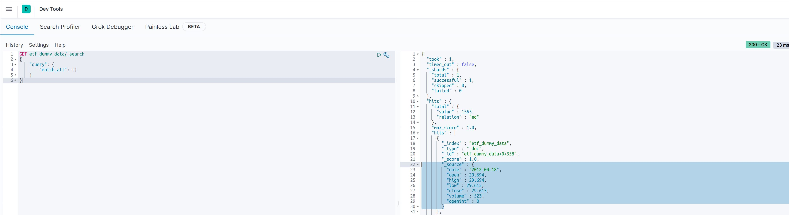

# Kafka proto 
This repo is used to interact with protobuf data for kafka.
We have a python producer that creates several outputs on kafka, each topic with its own schema.
From here on you can use kafka connect or other technologies to push the data to other solutions.

The data itself was taken from a kaggle competition.

## Getting started
You will need the following tools to get started:
* Python 3
* Installation of requirements.txt in a virtualenv
* Install docker and docker-compose
* Run docker-compose before starting

## Proto files
The following proto files are present
* etf.proto: A simple proto file with basic datatypes
* etf_complex.proto: A proto file with complex data types
* etf_http_ref.proto: A proto file that has an http link as a reference

## Starting the docker environment
The docker environment can be started with the single command:
```bash
docker-compose -f docker-compose.yml up -d
```

The following technologies will be started:
* Confluent center and all related technologies
* ElasticSearch and Kibana
* MySql
* InfluxDB

## Running the python producer
The following script needs to be executed:
```python
.../kafka_proto_py/kafka_proto_api/start_producer.py
```
You will need to set the working directory to the root of the project. 

## Running the kafka connector
The repo also contains an example of a kafka connector under the folder `kafka-connect`.
The file present will start a kafka connect job that will read the data from the configured topic and write it to 
elasticsearch.
You can run the following command from the `kafka-connect directory`
```bash
curl -X POST http://localhost:8083/connectors -H "Content-Type: application/json" -d '@etf-2-elk.json'
```
Additional connectors have been added and can be run with the above command. Don't forget to alter the data input.

## Installing additional connectors
If you want you can install additional kafka connectors by editing the file in `docker/DockerfileConnect`.
To make the maintenance easier, we install connectors through the command `confluent-hub install`.

If `confluent-hub` is not present I suggest you download the individual zip files, place them in the docker directory
and unzip them. Using the `ADD` command in docker, you can add the individual directories.

## Changing image versions and repos
If you want to change the versions of certain images or change the repo from where you want to pull (in case you have mirrored
the images), you can edit the `.env` file, which is present in the root directory.

## Querying the data 
If you want to verify if the data is in elasticsearch you will need to create an index. This can be done from the 
kibana console, which is reachable from the URL `http://localhost:5601`

Once the index is created you can create the dev tool to query the data as per the screenshot


## Ksql DB
If you want to use Ksql Db you will need to exec into the docker image of the ksqldb-cli.
From here you can start the interactive query mode by using the command:
```commandline
ksql http://ksqldb-server:8088
```

Before starting your query sessions here are some values you might set before starting to query:
```
SET 'ksql.streams.cache.max.bytes.buffering' = '10000000';
SET 'auto.offset.reset' = 'earliest';
```

If you have a complex schema in protobuf and want to create a stream on top you need to specify VALUE_SCHEMA_FULL_NAME and set it to the root message
```
CREATE STREAM etf_dummy_data_complex_stream WITH (KAFKA_TOPIC='etf_dummy_data_complex',VALUE_FORMAT='PROTOBUF',VALUE_SCHEMA_FULL_NAME='etf_complex');
```

## Contributing
If you want to contribute, please abide by the following rules:
* Create a feature branch and add your changes
* Create a pull request to merge into master
* Have a reviewer and merge